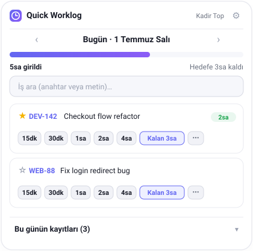
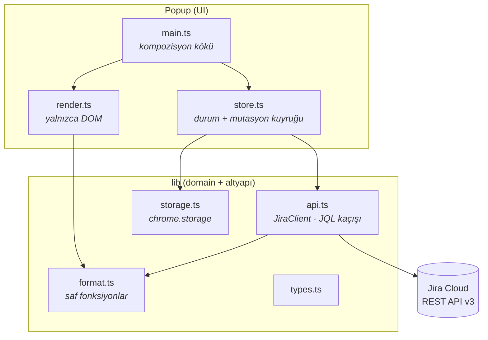

<div align="center">

# Jira Quick Worklog

**Jira worklog girişlerini tek tıkla yap — mesai kaydıyla uğraşmayı bırak.**

Geliştiricilerin en sevmediği işlerden biri: gün sonunda birkaç tickete dokunmuşsundur, bir yere
8 saat yazman gerekir ama Jira'nın worklog ekranı her kayıt için tarih, saat, süre ve yorum ister.
**Jira Quick Worklog** bu sürtünmeyi kaldırır: çalıştığın işin yanındaki süre çipine dokun, bitti.




</div>

---

## Çözdüğü sorun

Bir günün sonunda üç ayrı işe dokunmuşsundur, bir yere 8 saat borçlusundur ve Jira'nın worklog
diyaloğu **her giriş için** ayrı ayrı tarih, başlangıç saati, süre ve yorum ister. Sonuçta insanlar
worklog'u cumaya biriktirir, sayıları tahminle girer ya da hiç girmez.

Jira Quick Worklog bunu bitirir:

- Bir ön-tanımlı çipe (`15dk · 30dk · 1sa · 2sa · 4sa`) dokun → o süre anında o işe yazılır.
- **“Kalan 3sa”** çipi, günlük hedefinden kalanı tek tıkla tek bir işe yükler — günü kapatmanın en hızlı yolu.
- Günü bölmek istersen farklı işlere farklı çiplere dokun. İlerleme çubuğu toplamı canlı takip eder.

## Özellikler

- ⚡ **Tek tık kayıt** — her işin yanında süre çipleri; diyalog yok, ekran değiştirme yok
- 🎯 **Akıllı “kalan” çipi** — günlük hedefe (varsayılan 8sa) kalanı tek tıkla doldurur
- 🧩 **Böl veya topla** — günü işlere dağıt ya da hepsini tek taska yaz
- ↩️ **Geri al & sil** — her girişten sonra geri-al bildirimi; günün kayıtlarını tek tıkla sil
- 📅 **Gün gezinme** — dünü ya da geçmiş herhangi bir günü sonradan doldur
- ⭐ **Favoriler** — sürekli çalıştığın işleri en üste sabitle
- 🔎 **Arama** — işi anahtarla (`DEV-142`) veya serbest metinle bul
- 🌗 **Açık / koyu** — işletim sistemi temasını takip eder
- 🔒 **Kimlik yalnızca cihazda** — API token asla cihazından çıkmaz

## Teknoloji

| Alan | Tercih |
| --- | --- |
| Dil | TypeScript (strict; `noUnusedLocals`/`noUnusedParameters`/`noImplicitOverride`) |
| Platform | Chrome Extension **Manifest V3** |
| API | Jira Cloud **REST API v3** (Basic auth: e-posta + API token) |
| Derleme | yalnızca `tsc` — **sıfır runtime bağımlılığı**, bundler yok |
| Test | Node yerleşik test runner (`node --test`) |
| Depolama | `chrome.storage.local` |

## Kurulum

### Gereksinimler
- Node.js ≥ 20
- Bir Jira Cloud API token — buradan oluştur:
  [id.atlassian.com → Security → API tokens](https://id.atlassian.com/manage-profile/security/api-tokens)

### Derleme
```bash
npm install      # typescript + @types/chrome (yalnızca geliştirme)
npm run build    # src/ → dist/
```
Geliştirirken: `npm run watch` (kaydettikçe derler) · `npm test` (birim testleri).

### Chrome'a yükleme
1. `chrome://extensions` adresini aç
2. Sağ üstten **Geliştirici modu**'nu aç
3. **Paketlenmemiş öğe yükle** → bu klasörü seç
4. 🧩 menüsünden saat ikonunu sabitle

### İlk çalıştırma
İkona tıkla → **Ayarları Aç** → Jira adresi, e-posta ve API token gir → **Bağlantıyı Test Et** →
**Kaydet**. Sonra çiplere dokunmaya başla.

## Ayarlar

| Ayar | Varsayılan | Açıklama |
| --- | --- | --- |
| Jira adresi | – | örn. `https://sirketiniz.atlassian.net` |
| E-posta | – | Atlassian hesap mailin |
| API token | – | yalnızca yerelde saklanır, senkronlanmaz |
| Günlük hedef | `8sa` | ilerleme çubuğunu ve “kalan” çipini besler |
| Başlangıç saati | `9` | worklog `started` saatleri buradan sıralanır |
| İş listesi JQL | `assignee = currentUser() AND statusCategory != Done ORDER BY updated DESC` | listede hangi işlerin görüneceği |

**Süre girişi** (`⋯` alanı): `1.5` (saat), `90m`, `1h30m`, `2h` ve Türkçe `2sa` / `30dk` kabul eder.

## Mimari

Sorumluluklar net ayrık — her modülün tek işi var, bağımlılıklar içeri doğru akar:



- **`store.ts`** tüm durumu tutar. Worklog ekleme/silme bir **promise kuyruğundan** geçer; böylece hızlı
  çip tıklamaları sıraya girer ve `started` saatleri asla çakışmaz.
- **`render.ts`** saf görünümdür: durum + handler alır, DOM üretir. API, chrome ya da storage bilmez.
- **`api.ts`** tek HTTP sınırıdır. Her JQL `escapeJql`'den, her issue anahtarı `isIssueKey`'den geçer.
- **`format.ts`** bağımlılıksız ve tamamen birim-testlidir.

### Proje yapısı
```
.
├── src/
│   ├── lib/          # types · format · storage · api
│   ├── popup/        # store · render · main
│   └── options/      # ayarlar ekranı
├── test/             # node --test birim testleri
├── tools/            # make-icons.mjs (sıfır bağımlılık ikon üretici)
├── icons/            # üretilmiş PNG ikonlar
├── docs/preview.svg  # README görseli
├── popup.html · options.html · *.css
├── manifest.json · tsconfig.json · package.json
├── LICENSE
└── README.md
```

## Güvenlik & gizlilik

- API token `chrome.storage.local`'da tutulur — **yalnızca cihazında**, Google hesabına senkronlanmaz,
  Jira dışında (HTTPS üzerinden) hiçbir yere gönderilmez.
- XSS yüzeyi yok: tüm dinamik içerik `textContent` ile yazılır, asla `innerHTML` ile değil.
- JQL her zaman kaçışlanır, issue anahtarları API'ye ulaşmadan doğrulanır.
- Ağ erişimi `https://*.atlassian.net/*` ile sınırlıdır.

> ⚠️ API token'ını parola gibi koru — yalnızca tarayıcının yerel depolamasında yaşar, repoda değil.
> Token bir şekilde açığa çıkarsa iptal edip yenisini oluştur.

## Yol haritası

- [ ] Haftalık özet & “Salı günü girmeyi unuttun” hatırlatmaları
- [ ] Açık Jira sekmesinden mevcut issue'yu otomatik yakalama (content script)
- [ ] “N saati seçili işlere dağıt” toplu paneli
- [ ] Chrome Web Store yayını
- [ ] İngilizce arayüz (i18n)

## Katkı

Issue ve PR'lar memnuniyetle karşılanır. PR açmadan önce `npm test` ve `npm run build`
(`tsc --strict` temiz geçmeli) çalıştır.

## Lisans

Kaynağı açık, **ticari olarak satılamaz**. Ayrıntılar için [LICENSE](LICENSE).

---

<p align="right">
  <sub><b>Kadir Top</b> tarafından geliştirildi · Açık kaynak, ücretsiz — ticari olarak satılamaz<br>
  🔗 <a href="https://github.com/Kadirify/Jira-Quick-Worklog">github.com/Kadirify/Jira-Quick-Worklog</a></sub>
</p>
